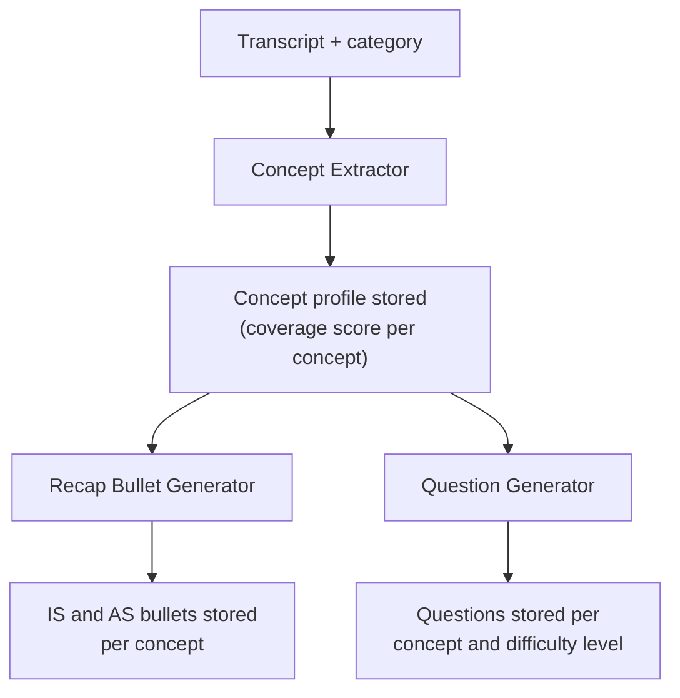
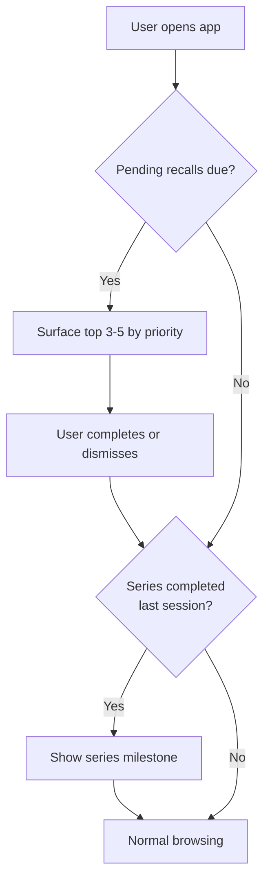
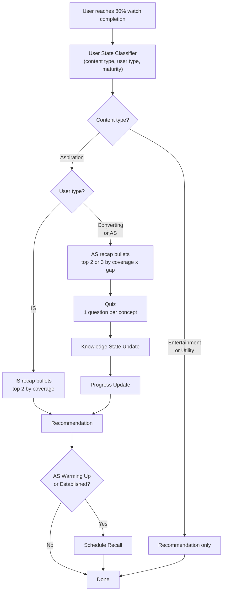

# Solution Overview

This document describes how Saathi processes videos before users watch them, and what happens when a user reaches the end of a video. For the broader AI vision, see [03-ai-vision.md](03-ai-vision.md). For the scoped problem, see [04-scoped-problem.md](04-scoped-problem.md).

The system has three distinct phases: preprocessing (before any user interaction), session start (when a user opens the app), and the per-video pipeline (when a user finishes a video). All LLM work happens in preprocessing. The session start and per-video phases are pure selection and scoring logic.

---

## Video Preprocessing

Every video on the platform goes through a preprocessing pipeline before it is served to users. This is where all LLM work happens. The output is a set of stored artifacts that the interaction pipeline reads at runtime without making any LLM calls.

For the prototype, this pipeline runs manually using a video transcript as the only input. Concept extraction, recap bullet generation, and question generation all happen in this step.




### Step 1: Concept Extraction

Maps the transcript to the fixed concept taxonomy for that video's category. The taxonomy is authored once per skill-learning category, with 4-5 concepts per category. The extractor does not invent new concepts outside this taxonomy.

The output is a concept profile: a dictionary of concept key to coverage score (0 to 1). Concepts below 0.2 coverage are excluded. A brief mention of a concept should not generate recap bullets or quiz questions about it.

Example for a Career & Jobs interview video:

```json
{
  "body_language": 0.9,
  "voice_modulation": 0.8,
  "answering_structure": 0.6,
  "handling_nervousness": 0.5
}
```

This profile is deterministic and is used by every downstream preprocessing step and by the interaction pipeline at runtime.

### Step 2: Recap Bullet Generation

For each concept in the concept profile, the LLM generates two recap bullets: one for Information Seeker (IS) users and one for Aspiration Seeker (AS) users. The IS version is lower pressure and framed around immediate usefulness. The AS version is richer and frames the concept as part of ongoing skill development.

Both versions are generated once and stored. At interaction time, the system picks which version to show based on the user's type. No LLM call happens at that point.

Storage key: `recap_bullets[video_id][concept][user_type]`

Example for `body_language` from an interview video:

- **IS:** "Sitting upright and keeping your hands calm makes a strong first impression without saying a word."
- **AS:** "Body language speaks before you do. Posture, eye contact, and hand stillness are learnable signals that interviewers read before you answer the first question."

### Step 3: Question Generation

For each concept in the concept profile, the LLM generates questions across three difficulty levels:

- **Easy:** Recognition. The answer is directly stated in the video.
- **Medium:** Application. The user has to apply the concept to a scenario.
- **Hard:** Synthesis. The user has to reason across concepts or handle an edge case.

Multiple questions are generated per difficulty level to support rotation across quiz and recall sessions. They are stored inside the video dict, nested under `questions[concept][difficulty]`. The same structure serves both the in-session quiz and future recall sessions. Generating them at ingestion time means no user ever triggers an LLM call during their interaction. 

---

## Session Start

When a user opens the app, the system checks two conditions before normal browsing begins. This check happens once per session and is completely separate from the per-video pipeline.




**Pending recalls** are surfaced first if any are due. The user sees the top 3-5 ranked by priority. They can complete them or dismiss and go straight to browsing. No penalty for dismissal.

**Series completion** is checked after recalls (or immediately if there are none). If the user finished the last video in a content series in their previous session, Saathi shows a milestone summary before normal browsing begins.

After both checks, the session continues normally. What happens during session start has no bearing on the per-video pipeline.

---

## The Per-Video Pipeline

The pipeline fires when a user reaches 80% watch completion on a video. Waiting for 100% would lose users who skip the last few seconds.

Three classifiers determine what happens: content type, user type, and maturity. The same video produces a different experience depending on who is watching it.




### The Three Classifiers

**Content type** is the first gate. Set at the category level and authored editorially.

- **Entertainment:** Not skill-learning. Crime, Horror, Cricket, Ramayan, Devotion, History. No pipeline runs. Recommendation only.
- **Utility:** Skill-learning categories where users come for a specific, one-time answer. Sarkari Kaam, Mobile Tricks, Life Hacks. No recap, no quiz, no recall. Recommendation only.
- **Aspiration:** Skill-learning categories where users build toward a longer-term goal. English Speaking, Career & Jobs, Business, Share Market, Exam Prep, Coding. The full pipeline runs here.

Some categories could go either way. Finance could be utility (check this one thing) or aspiration (build financial literacy over time). The default is set at the category level. Individual videos can override if needed, but for this prototype the category-level label is sufficient.

**User type** is derived from watch history. Three types:

- **Information Seeker (IS):** Primarily watches utility content or is very new to the platform. Comes for specific answers, not skill-building. Gets a low-pressure experience with no quiz.
- **Aspiration Seeker (AS):** Clearly oriented toward skill-building. Either concentrates in a specific aspiration category or watches aspiration content broadly across categories. Gets the full loop: recap, quiz, recall.
- **Converting:** In between. Showing some aspiration intent but not yet a consistent pattern. Gets the AS experience with guardrails: AS-toned bullets, quiz capped at medium difficulty, no recall scheduled yet.

**Maturity** is derived from account tenure: New (0-7 days), Warming Up (1-4 weeks), Established (1+ month). Maturity does not change the pipeline shape. It affects two things: whether recall is scheduled (AS New users do not get recalls yet) and the recommendation engine's temperature.

### Pipeline Behavior by User Type


| User Type                      | Recap                               | Quiz                                        | Progress Update | Recommendation    | Recall Scheduled |
| ------------------------------ | ----------------------------------- | ------------------------------------------- | --------------- | ----------------- | ---------------- |
| IS                             | IS bullets, top 2 by coverage       | None                                        | None            | Yes, gentle nudge | No               |
| Converting                     | AS bullets, top 2 by coverage x gap | Top 2 concepts, difficulty capped at medium | Yes             | Yes               | No               |
| AS (New)                       | AS bullets, top 3 by coverage x gap | Top 3 concepts, difficulty capped at medium | Yes             | Yes               | No               |
| AS (Warming Up or Established) | AS bullets, top 3 by coverage x gap | Top 3 concepts, full difficulty range       | Yes             | Yes               | Yes              |


The IS path is deliberately low-pressure. Rahul watches a Sarkari Kaam video about linking Aadhaar, gets his answer, and Saathi says: "Got it. Here's another one people found useful." No quiz, no score. If he then watches an aspiration video, Saathi shows two IS-toned bullets and a gentle recommendation. The goal is not to scare away a user who is still deciding whether this platform is for them.

Demo users: Priya (AS, Warming Up, 14 days, pre-loaded weak spots in `body_language` and `answering_structure` at 0.3) and Rahul (IS, New, 3 days, empty knowledge state).

---

### Pipeline Components

#### 1. User State Classifier

Reads the user profile and watch history and outputs three values: `content_type`, `user_type`, and `maturity`. Every downstream component reads from these. Runs first, before anything else.

Also sets the recommendation engine's temperature: more exploration for new users, more targeting for established ones.

**User type classification**

Evaluated against the last 10 non-entertainment videos. Entertainment is excluded because it carries no utility or aspiration signal. If fewer than 10 non-entertainment videos exist, all available history is used.

Conditions are checked in order. The first match wins.

**Step 1 → IS (utility dominant):** utility% >= 50% in last 10 non-entertainment videos.

A user who is at least half utility in recent history gets the IS experience regardless of any aspiration signal.

**Step 2 → AS (depth):** 3+ videos in the same aspiration category in last 10.

Category concentration is a strong intent signal. Three career videos in a row is not accidental browsing. This step fires before the new-user default so early concentrated intent is not suppressed.

**Step 3 → IS (new user):** fewer than 5 non-entertainment videos total.

At this point utility% is below 50% but there is not enough history to classify confidently. Default to IS. Step 2 already handled the case where a new user shows strong category intent.

**Step 4 → AS (breadth):** aspiration% >= 70% in last 10.

Handles the user who watches aspiration content broadly across multiple categories without concentrating in one. At this step we know: utility < 50%, no single-category concentration, and enough data exists (5+ videos).

**Step 5 → Converting:** everything else.

Mixed pattern or active transition. Aspiration intent is present but not yet dominant.

| Case | Step that fires | Result |
|---|---|---|
| 7 utility + 3 career in last 10 | Step 1 (utility >= 50%) | IS |
| 3 career videos, total 3 | Step 2 (3+ in career) | AS |
| 2 aspiration videos, total 2 | Step 3 (< 5 total) | IS |
| 4 career + 3 utility + 3 business in last 10 | Step 2 (4 in career, utility 30%) | AS |
| 8 aspiration spread + 2 utility in last 10 | Step 4 (80% aspiration) | AS |
| 5 aspiration + 4 utility in last 10 | Step 4 (55% aspiration, < 70%) | Converting |

---

#### 2. Recap Engine

Selects which pre-generated bullets to show the user. No LLM call at this step.

Concepts are ranked by `coverage_score x user_gap`, where `user_gap = 1 - knowledge_state[concept]`. The top 2 or 3 are shown depending on user type. For a new user with no knowledge state, all gaps are 1.0, so selection falls back to coverage score alone.

Example for Priya (AS, Warming Up) after watching an interview confidence video, with `body_language` at 0.3 and `answering_structure` at 0.3:

> - Body language speaks before you do. Sit upright, keep your hands calm, and make eye contact when answering.
> - When you get a question, pause for a second before answering. Structure your response: what you did, how you did it, and what happened.
> - Nervousness is normal. The interviewer is judging your answers, not your anxiety. Take a breath before your first response.

---

#### 3. Quiz Engine

Selects questions from the video dict for the same concepts the recap just covered, in the same rank order. No LLM call at this step.

One question per concept. Difficulty is set by the user's current concept score:

- Score below 0.2: Easy
- Score 0.2 to 0.5: Medium
- Score above 0.5: Hard

For AS New and Converting users, difficulty is capped at medium regardless of score. This keeps the first few sessions approachable.

Maximum of 3 questions per quiz session, keeping the total interaction under 2 minutes.

---

#### 4. Response Evaluator

Compares the selected answer index against the stored correct index. Returns 1 (correct) or 0 (wrong) per question. Fully deterministic, no LLM.

Skipped questions are scored as 0. The system cannot assume knowledge from silence. If the user skips the entire quiz, no quiz scores are recorded, the knowledge state receives only the passive watch bump, and no recall is scheduled for those concepts.

Quiz score per concept: `quiz_score = correct / total`. With one question per concept, this is binary.

---

#### 5. Knowledge State Updater

Maintains per-user, per-concept mastery scores from 0 to 1 using Exponential Moving Average (EMA).

**Watch (passive):**

```
new_score = min(0.8, score + 0.1 x completion_rate x concept_score)
```

Watching is a weak signal. So it will only do a smaller bump, capped at 0.8 per concept. We cannot assume full mastery of a concept just by watching the relevant video.

**Quiz (active learning):**

```
new_score = current_score + 0.3 x (quiz_score - current_score)
```

Example with `body_language` at 0.3: a correct answer gives 0.3 + 0.3 x 0.7 = 0.51. A wrong answer gives 0.3 + 0.3 x (-0.3) = 0.21.

**Recall (retention test):**

```
new_score = current_score + 0.15 x (result - current_score)
```

Smaller alpha (0.15 vs 0.3) because recall tests existing knowledge rather than introducing new learning.

Scores never decay passively. They only drop when a quiz or recall test fails.

---

#### 6. Progress Update

Reads the before and after scores from the knowledge state update and generates a short message. Shown only for AS and Converting users.

Example: "Body Language: 30% to 51%. You're getting better at holding your presence in the room."

If no concept improved, the message shifts to encouragement: "Tough questions. Saathi now knows exactly where to focus next session."

---

#### 7. Recommendation Engine

Selects the next video. The output is one video with a brief explanation of why it was chosen. One clear next step, not a list to scroll through.

**Candidate pool:**

- 80% from the same category the user just watched
- 15% from adjacent categories (editorial adjacency map)
- 5% random from the full catalog

The adjacent 15% is how IS users get gentle exposure to aspiration content. The random 5% is the discovery bucket: without it, the system is fully controlled and users never stumble across something unexpected.

The editorial adjacency map defines which categories are related:

- Career & Jobs adjacent to English Speaking, Exam Prep
- Business adjacent to Share Market, Marketing, Startups
- Finance adjacent to Share Market
- Sarkari Kaam adjacent to Exam Prep
- English Speaking adjacent to Business

This map is authored editorially and updated as the category set evolves. For this prototype, only the adjacency between the 4 demo categories is active.

**Scoring:**

Gap vector: `gap[c] = 1 - assumed_score[c]`

For categories the user has not engaged with, `assumed_score[c] = 0.5` (neutral prior). This is a local heuristic used only by the recommendation engine. The stored knowledge state is not changed. Without this, every concept in an unseen adjacent category would have gap = 1.0, making all adjacent videos score very high. So we start with a reasonable mid point. Once the user quizzes in that category, the real score takes over.

Relevance score: `relevance = sum(concept_profile[c] x gap[c])`

For already-watched videos, a revisit penalty is applied:

```
final_score = relevance x (1 - quiz_score_at_watch) x time_decay(days)
time_decay(d) = 1 - exp(-d/30)
```

A video the user did well on gets heavily suppressed. A video the user struggled with a month ago and still hasn't mastered scores high. If the quiz was skipped, `quiz_score_at_watch = 0.5` (moderate suppression). For new videos, `final_score = relevance` with no penalty.

**Sampling:**

```
prob(video) proportional to exp(final_score / temperature)
```

Temperature by user state: AS Established = 0.3 (sharp targeting), AS Warming Up = 0.5, IS Warming Up = 0.8, IS New = 1.2, first session = 1.5. Higher temperature means broader exploration; lower means tighter targeting.

---

#### 8. Recall Scheduler

Writes a recall entry for each concept that was quizzed. Only runs for AS Warming Up and AS Established users.

```json
{
  "user_id": "priya_001",
  "concept_key": "body_language",
  "source_video_id": "vid_003",
  "due_at": "2026-03-30T10:00:00Z",
  "interval_hours": 18,
  "missed_count": 0,
  "status": "pending",
  "last_question_id": null
}
```

**Intervals** based on concept score at quiz time:

- Score below 0.4: 18 hours
- Score 0.4 to 0.6: 30 hours
- Score above 0.6: 48 hours

Correct recall doubles the interval. Wrong recall halves it, minimum 12 hours.

**Surfacing** At session start, items are surfaced by first filtering for eligibility (time since last recall ≥ interval), then ranking eligible items by `priority = urgency × importance`, where `urgency = days_overdue + 1` and `importance = 1 − current_concept_score`. The top 3–5 items are shown, and the rest carry over to the next session.

**Missed recalls** are not penalized. The user did not fail the recall, they were simply not present. The entry reschedules to the next session at the same interval. After 3 misses, the interval is halved so the concept surfaces sooner.

**Recall questions** are drawn from the `questions` field of video dicts for videos the user has already watched. Only questions generated from transcripts the user has seen are eligible. The `last_question_id` field prevents the same question from repeating back to back. As the user watches more videos covering a concept, the eligible pool grows.

---

## Knowledge State Architecture

Two structures drive all runtime behavior: the user dict and the video dict.

**User dict**

Contains the profile, knowledge state, and watch history for a single user. The classifier reads from here; the knowledge state updater writes to it.

Knowledge state is per-category. A concept like `body_language` is stable across many Career & Jobs videos. Mastery is a single score that grows over time, not fragmented per video. A category only appears in `knowledge` once the user has watched a video and completed a quiz in it. Until then, the recommendation engine uses the 0.5 neutral prior for gap calculations.

Watch history is used by the recommendation engine for the revisit penalty and by the recall scheduler to scope eligible questions to videos the user has already seen.

```json
{
  "user_id": "priya_001",
  "user_type": "AS",
  "maturity": "warming_up",
  "first_seen": "2026-03-15",
  "total_videos_watched": 8,
  "knowledge": {
    "Career & Jobs": {
      "body_language": 0.51,
      "voice_modulation": 0.7,
      "answering_structure": 0.35,
      "handling_nervousness": 0.55,
      "preparation": 0.0
    },
    "English Speaking": {
      "vocabulary": 0.3,
      "pronunciation": 0.2,
      "grammar": 0.0,
      "fluency": 0.0
    }
  },
  "watch_history": [
    {
      "video_id": "vid_003",
      "category": "Career & Jobs",
      "content_type": "aspiration",
      "watched_at": "2026-03-28T14:00:00Z",
      "completion_rate": 0.92,
      "quiz_scores": {
        "body_language": 1.0,
        "answering_structure": 0.0
      }
    },
    {
      "video_id": "vid_007",
      "category": "Career & Jobs",
      "content_type": "aspiration",
      "watched_at": "2026-03-27T11:00:00Z",
      "completion_rate": 0.85,
      "quiz_scores": {
        "voice_modulation": 1.0,
        "handling_nervousness": 1.0
      }
    }
  ],
  "last_updated": "2026-03-28T14:30:00Z"
}
```

**Video dict**

All preprocessing output for a single video: concept profile, recap bullets, and questions. Created once at ingestion. No LLM calls happen after this.

Questions are stored per concept per difficulty, with multiple questions at each level to support rotation. The quiz engine picks one question per session; the recall scheduler draws from the same pool, filtered to videos the user has already watched.

```json
{
  "video_id": "vid_003",
  "category": "Career & Jobs",
  "content_type": "aspiration",
  "concept_profile": {
    "body_language": 0.9,
    "voice_modulation": 0.8,
    "answering_structure": 0.6,
    "handling_nervousness": 0.5
  },
  "recap_bullets": {
    "body_language": {
      "IS": "Sitting upright and keeping your hands calm makes a strong first impression.",
      "AS": "Body language speaks before you do. Posture, eye contact, and hand stillness are learnable signals that interviewers read before you say a word."
    },
    "answering_structure": {
      "IS": "Take a breath before answering. A short pause to collect your thoughts reads as confidence, not hesitation.",
      "AS": "Structure is a skill. What you did, how you did it, and what happened. Once that frame is automatic, your answers become easier to follow and harder to dismiss."
    }
  },
  "questions": {
    "body_language": {
      "easy": [
        {
          "id": "q_bl_e_001",
          "text": "What does sitting upright signal to an interviewer?",
          "options": ["Nervousness", "Confidence and preparedness", "Disinterest", "Familiarity"],
          "correct_index": 1
        },
        {
          "id": "q_bl_e_002",
          "text": "Which of the following is a body language signal the interviewer reads before you speak?",
          "options": ["Your vocabulary", "Your posture", "Your qualifications", "Your resume"],
          "correct_index": 1
        }
      ],
      "medium": [
        {
          "id": "q_bl_m_001",
          "text": "You are nervous and tend to fidget. What is the most effective body language adjustment before an interview?",
          "options": ["Speak faster to move past the nerves", "Keep hands still and rest them on the table", "Avoid eye contact to reduce pressure", "Cross your arms to appear composed"],
          "correct_index": 1
        },
        {
          "id": "q_bl_m_002",
          "text": "An interviewer glances away while you are answering. What should you do?",
          "options": ["Speed up your answer to finish sooner", "Slow your pace and make deliberate eye contact", "Ask if they have any questions", "Repeat the question back to them"],
          "correct_index": 1
        }
      ],
      "hard": [
        {
          "id": "q_bl_h_001",
          "text": "You notice your body language is closed but your answer is strong. What does the research on interviewer perception suggest?",
          "options": ["Strong answers always outweigh body language", "Interviewers weight non-verbal signals heavily in first impressions, sometimes more than content", "Closed posture signals focus and is read positively", "Body language only matters after the first 10 minutes"],
          "correct_index": 1
        }
      ]
    },
    "answering_structure": {
      "easy": [
        {
          "id": "q_as_e_001",
          "text": "What is the three-part structure recommended for answering behavioral questions?",
          "options": ["Problem, solution, outcome", "What you did, how you did it, what happened", "Introduction, body, conclusion", "Situation, task, result"],
          "correct_index": 1
        }
      ],
      "medium": [...],
      "hard": [...]
    }
  }
}
```

---

## Metrics

Nine metrics across two groups. The first two measure whether Saathi is working at the platform level. The remaining seven diagnose which part of the loop is functioning and which is not. All metrics should be segmented by user type (IS, AS, Converting) and maturity where relevant. Averages across all users obscure the actual pattern.

### Is Saathi working?

**1. Retention Lift**

Compares 30-day retention between users who completed at least one full loop (recap, quiz, recall) and users who only watched. This is the outcome Saathi is designed to move.

`Retention Lift = 30-day retention (Saathi-engaged) - 30-day retention (watch-only)`

A near-zero lift means the loop is not affecting whether users stay on the platform. The remaining metrics identify where it breaks down.

---

**2. IS-to-AS Conversion Rate**

Tracks how many IS users are classified as Converting or AS at the 30-day mark. IS users who convert tend to stay longer and engage more consistently with the full loop. This is the core growth mechanism described in [03-ai-vision.md](03-ai-vision.md).

`Conversion Rate = IS users whose classifier output is Converting or AS at day 30 / IS users active for 30+ days`

Status at day 30 is used, not whether reclassification ever happened. A user who briefly reached AS and then reverted to utility behavior will be classified IS again by the rolling window classifier and will not be counted. If the user has no session near day 30, their last known classification is used. Converting is counted because it represents a genuine and sustained behavioral shift toward aspiration content, even if full AS classification has not been reached. Low conversion typically surfaces first in Recommendation Acceptance Rate on the adjacent 15% pool, which is the primary route for IS users to encounter aspiration content.

---

### Is the loop functioning?

**3. Quiz Completion Rate**

Measures how often users complete the quiz when it is offered. Without quiz completion there is no knowledge state update, no recall is scheduled, and the session ends as a passive watch.

`Quiz Completion Rate = quizzes completed / quizzes offered`

Segment by maturity. Low rates for AS New users may indicate the medium difficulty cap is still too aggressive. Low rates across all user types suggest a timing or relevance issue: the quiz appears at the wrong moment or feels disconnected from the video.

---

**4. Recall Response Rate**

Measures how often users complete a scheduled recall session. Recalls being scheduled does not mean they are being done. If response rate is low, spaced repetition is not functioning in practice.

`Recall Response Rate = recalls completed / recalls scheduled`

Cross-check with Retention Lift. If both are low, the loop is not pulling users back between sessions. If only recall response is low but retention is otherwise healthy, the issue is likely in how recalls are surfaced at session start rather than overall engagement.

---

**5. Session Return Rate**

Measures whether completing a full loop produces a return visit within 48 hours. This is separate from Recall Response Rate, which only counts recall-specific returns.

`Session Return Rate = sessions followed by a return within 48h / sessions where full loop was completed`

Low return rate despite healthy quiz completion points to the post-quiz experience: the progress update, the recall schedule interval, or the next video recommendation.

---

**6. Recommendation Acceptance Rate**

Measures how often the recommended video is watched. Low acceptance means the gap-based scoring is not surfacing content users want to watch next.

`Acceptance Rate = recommended videos watched / recommendations shown`

Decompose by pool when diagnosing: same-category 80%, adjacent 15%, random 5%. The adjacent pool drives IS-to-AS conversion. Low acceptance on that slice indicates either the adjacency map is misaligned or the IS user is not ready for aspiration content at that point. The random 5% is expected to run lower by design.

---

**7. Recall Accuracy**

Measures how often users answer recall questions correctly. Recall tests retention across an interval, not immediate recall of what was just watched.

`Recall Accuracy = correct recall answers / total recall answers attempted`

Low accuracy across the board suggests intervals are too long. Low accuracy on specific concepts points to gaps in the recap coverage or questions misaligned with what the video actually taught.

---

**8. Recall Lift**

Compares a user's recall score on a concept against their quiz score from the original session on the same video. Recall Accuracy captures current performance; Recall Lift shows whether spaced repetition is improving retention over time.

`Recall Lift = recall score (concept) - quiz score (concept, same video, original session)`

Positive lift means the user retained or improved. Negative lift means they performed worse at recall than right after watching. Consistently negative lift points to intervals that are too long or an in-session quiz that did not establish a strong enough baseline.

---

**9. Concept Score Delta**

Measures how much a concept score moves in a single session. The EMA formula produces an expected delta of +0.1 to +0.3 per correct answer depending on the starting score. Consistently low deltas indicate the knowledge state is not updating with meaningful signal.

`Score Delta = knowledge_state[concept] (after quiz) - knowledge_state[concept] (before quiz)`

Near-zero deltas typically have one of three causes: questions are too easy so scores have little room to grow, the EMA alpha of 0.3 is too conservative for early sessions, or the concept coverage score in the video was too low to register signal.

---

### How they fit together

Retention Lift is the outcome metric. The remaining eight explain why it is what it is.

Low retention points to Session Return Rate and Recall Response Rate. If users complete the loop but do not return, the issue is downstream of the quiz: the progress update, the recall schedule, or the next video recommendation. If users are not completing the loop at all, Quiz Completion Rate is the upstream gate. Nothing runs without it.

If the loop is running but retention is still low, Recall Accuracy and Recall Lift show whether learning is sticking. Recall Lift isolates whether the spaced repetition intervals are helping. If the knowledge state looks unreliable, Concept Score Delta shows whether scores are moving at all.

IS-to-AS Conversion Rate is separate from the loop health metrics. It measures whether Saathi is growing the set of users who engage with the loop in the first place. Low conversion is diagnosed through Recommendation Acceptance Rate on the adjacent 15% pool, which is where IS users first encounter aspiration content.

---

## Demo Dataset

**taxonomy.json:** 4 demo categories from Seekho's actual category list. Career & Jobs is fully detailed with 5 concepts: `body_language`, `voice_modulation`, `answering_structure`, `handling_nervousness`, `preparation`. The other 3 (English Speaking, Business, Share Market) are named but their concept breakdowns are placeholders. In production, every skill-learning category gets its own 4-5 concept mapping.

**users.json:** Two user dicts. Each contains the full profile, knowledge state, and watch history in a single object (see Knowledge State Architecture).

Priya: AS, Warming Up, 14 days on platform, 8 total videos watched. Her watch history includes at least 3 Career & Jobs videos, which is what produces her AS classification under the rolling window classifier (Step 2: depth signal). Her knowledge state has pre-loaded weak spots in `body_language` (0.3) and `answering_structure` (0.3), with current scores slightly above that from prior quiz sessions.

Rahul: IS, New, 3 days on platform, fewer than 5 non-entertainment videos watched. Classified IS via the new-user default (Step 3). No quizzes completed, empty knowledge state.

Together they demonstrate how the same video produces a different experience depending on who is watching.

**videos.json:** 5 videos. 4 aspiration (Career & Jobs) and 1 utility (Sarkari Kaam). One transcript-backed video serves as the primary demo.

**video_artifacts.json:** Pre-generated video dicts for all demo videos. Each dict contains the concept profile, recap bullets (IS and AS versions per concept), and questions (multiple per concept per difficulty), all produced from running the preprocessing pipeline on the demo transcript.

**recall_queue.json:** Pending recall entries for Priya. Since she is AS Warming Up and has completed quizzes, the Recall Scheduler has written entries for the concepts she was quizzed on. This file is used to demonstrate the session-start recall surfacing. Rahul has no recall entries since IS users do not get recalls scheduled.

**transcripts/interview_confidence.txt:** Roughly 800 words covering all four Career & Jobs demo concepts. This is the input to the preprocessing pipeline.

---

## Limitations

**1. The system always targets weakness.**

Every recap, quiz, and recommendation is pointed at weak spots. This is right for learning velocity but will feel exhausting over time. Real learning systems mix challenge with consolidation. A better approach would occasionally serve easier questions on strong concepts and recommend content the user is likely to enjoy, not just content they need.

**2. The concept taxonomy takes time to scale across categories.**

Each skill-learning category needs a concept breakdown authored and reviewed before the pipeline can run. The process is LLM-assisted (the LLM proposes the breakdown) but human review is required before it goes live. Sub-skills also collapse into a single score: body language, for example, folds together eye contact, posture, and gestures. For the prototype with 4 categories this is fine. Across Seekho's full catalog of 40 categories, the review bottleneck becomes the constraint.

**3. Recall questions are scoped to watched videos, not the concept itself.**

Questions are generated from specific video transcripts. If a user has only watched one video covering a concept, the recall pool is limited to that video's questions. Even with multiple questions per difficulty level, a small pool means repetition. The pool only grows as the user watches more videos that cover the concept. Concept cards (short authored descriptions per concept, independent of any video) would solve this by providing a stable generation input for recall questions regardless of watch history.

**4. Goal completion is out of scope for this prototype.**

An AS user who achieves their goal has no way to signal it. The system will keep recommending the same category indefinitely. This is a known gap. The full solution is skill trees, described in [03-ai-vision.md](03-ai-vision.md). That design is not part of this prototype.

**5. There is no feedback loop from user behavior back to the content layer.**

All preprocessing artifacts (concept coverage scores, question difficulty bands, content type labels, category assignments) are set at ingestion and never updated. They reflect editorial judgment at the time a video is processed, not what actually happens when users engage with it.

In practice these artifacts drift. A video tagged as having 0.9 coverage of `body_language` may consistently produce low quiz scores on that concept, which means the coverage score is wrong. A question labeled easy may have a 30% success rate, which means it is medium or hard. A video labeled utility may drive consistent aspiration behavior, suggesting the content type label is wrong.

The signals to correct all of this already exist: quiz accuracy per concept per video, recall performance, watch completion rates, and recommendation acceptance. What is missing is a pipeline that aggregates those signals and feeds them back into the concept profiles, difficulty calibrations, and content metadata. This is the most important missing piece for a production system, because every part of the pipeline relies on the accuracy of these artifacts.