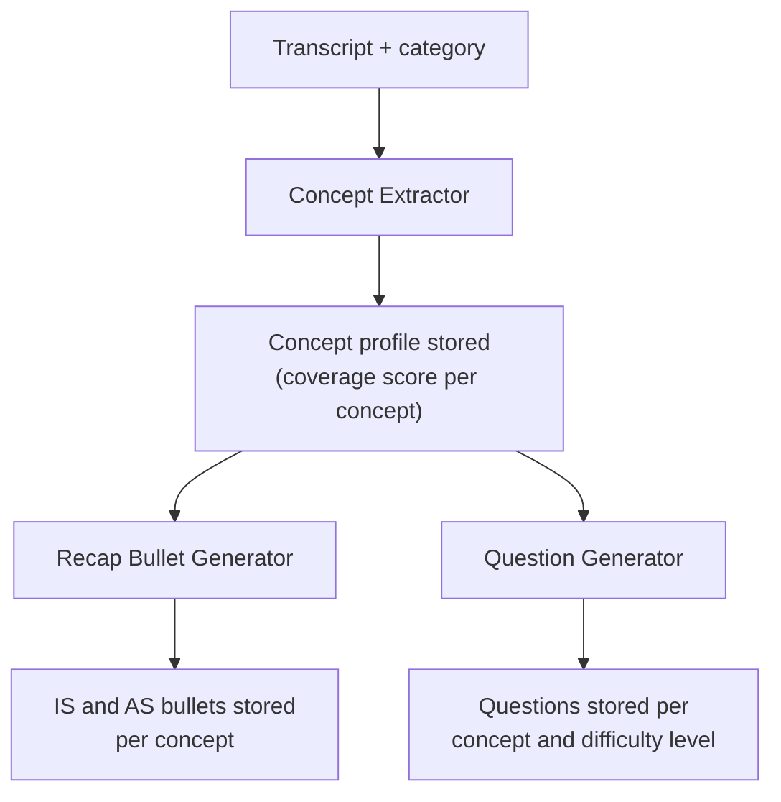
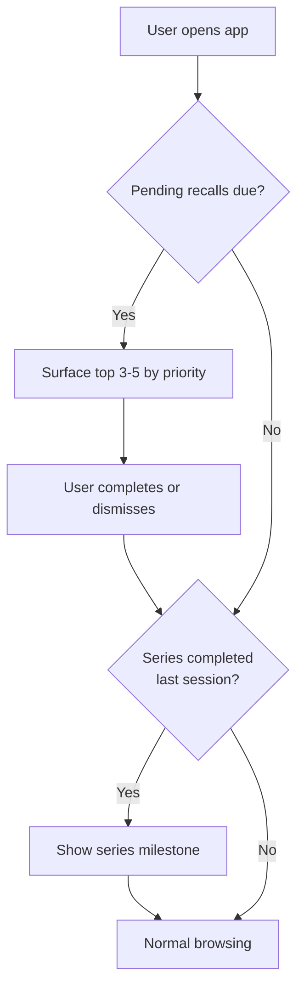
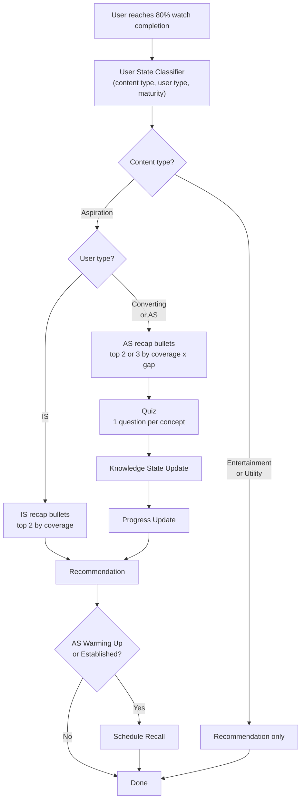

# Solution Overview

This document describes how Saathi processes videos before users watch them, and what happens when a user reaches the end of a video. For the broader AI vision, see [03-ai-vision.md](03-ai-vision.md). For the scoped problem, see [04-scoped-problem.md](04-scoped-problem.md).

The system has three distinct phases: preprocessing (before any user interaction), session start (when a user opens the app), and the per-video pipeline (when a user finishes a video). All LLM work happens in preprocessing. The session start and per-video phases are pure selection and scoring logic.

---

## Video Preprocessing

Every video on the platform goes through a preprocessing pipeline before it is served to users. This is where all LLM work happens. The output is a set of stored artifacts that the interaction pipeline reads at runtime without making any LLM calls.

For the prototype, this pipeline runs manually using a video transcript as the only input. Concept extraction, recap bullet generation, and question generation all happen in this step.



### Step 1: Concept Extraction

Maps the transcript to the fixed concept taxonomy for that video's category. The taxonomy is authored once per skill-learning category, with 4-5 concepts per category. The extractor does not invent new concepts outside this taxonomy.

The output is a concept profile: a dictionary of concept key to coverage score (0 to 1). Concepts below 0.2 coverage are excluded. A brief mention of a concept should not generate recap bullets or quiz questions about it.

Example for a Career & Jobs interview video:

```json
{
  "body_language": 0.9,
  "voice_modulation": 0.8,
  "answering_structure": 0.6,
  "handling_nervousness": 0.5
}
```

This profile is deterministic and is used by every downstream preprocessing step and by the interaction pipeline at runtime.

### Step 2: Recap Bullet Generation

For each concept in the concept profile, the LLM generates two recap bullets: one for Information Seeker (IS) users and one for Aspiration Seeker (AS) users. The IS version is lower pressure and framed around immediate usefulness. The AS version is richer and frames the concept as part of ongoing skill development.

Both versions are generated once and stored. At interaction time, the system picks which version to show based on the user's type. No LLM call happens at that point.

Storage key: `recap_bullets[video_id][concept][user_type]`

Example for `body_language` from an interview video:

- **IS:** "Sitting upright and keeping your hands calm makes a strong first impression without saying a word."
- **AS:** "Body language speaks before you do. Posture, eye contact, and hand stillness are learnable signals that interviewers read before you answer the first question."

### Step 3: Question Generation

For each concept in the concept profile, the LLM generates questions across three difficulty levels:

- **Easy:** Recognition. The answer is directly stated in the video.
- **Medium:** Application. The user has to apply the concept to a scenario.
- **Hard:** Synthesis. The user has to reason across concepts or handle an edge case.

Multiple questions are generated per difficulty level to support rotation across quiz and recall sessions.

Storage key: `question_bank[video_id][concept][difficulty][question_index]`

These questions serve both the in-session quiz immediately after watching and future recall sessions days later. Generating them at ingestion time means no user ever triggers an LLM call during their interaction. 

---

## Session Start

When a user opens the app, the system checks two conditions before normal browsing begins. This check happens once per session and is completely separate from the per-video pipeline.



**Pending recalls** are surfaced first if any are due. The user sees the top 3-5 ranked by priority. They can complete them or dismiss and go straight to browsing. No penalty for dismissal.

**Series completion** is checked after recalls (or immediately if there are none). If the user finished the last video in a content series in their previous session, Saathi shows a milestone summary before normal browsing begins.

After both checks, the session continues normally. What happens during session start has no bearing on the per-video pipeline.

---

## The Per-Video Pipeline

The pipeline fires when a user reaches 80% watch completion on a video. Waiting for 100% would lose users who skip the last few seconds.

Three classifiers determine what happens: content type, user type, and maturity. The same video produces a different experience depending on who is watching it.



### The Three Classifiers

**Content type** is the first gate. Set at the category level and authored editorially.

- **Entertainment:** Not skill-learning. Crime, Horror, Cricket, Ramayan, Devotion, History. No pipeline runs. Recommendation only.
- **Utility:** Skill-learning categories where users come for a specific, one-time answer. Sarkari Kaam, Mobile Tricks, Life Hacks. No recap, no quiz, no recall. Recommendation only.
- **Aspiration:** Skill-learning categories where users build toward a longer-term goal. English Speaking, Career & Jobs, Business, Share Market, Exam Prep, Coding. The full pipeline runs here.

Some categories could go either way. Finance could be utility (check this one thing) or aspiration (build financial literacy over time). The default is set at the category level. Individual videos can override if needed, but for this prototype the category-level label is sufficient.

**User type** is derived from watch history:

- **Information Seeker (IS):** 70%+ of watched content is utility, or fewer than 3 total videos watched.
- **Aspiration Seeker (AS):** 70%+ of watched content is aspiration, or 3+ videos in the same aspiration category.
- **Converting:** Mixed pattern. 30-70% aspiration content, or an IS user who has recently watched aspiration content for the first time.

**Maturity** is derived from account tenure: New (0-7 days), Warming Up (1-4 weeks), Established (1+ month). Maturity does not change the pipeline shape. It affects two things: whether recall is scheduled (AS New users do not get recalls yet) and the recommendation engine's temperature.

### Pipeline Behavior by User Type

| User Type | Recap | Quiz | Progress Update | Recommendation | Recall Scheduled |
| --- | --- | --- | --- | --- | --- |
| IS | IS bullets, top 2 by coverage | None | None | Yes, gentle nudge | No |
| Converting | AS bullets, top 2 by coverage x gap | Top 2 concepts, difficulty capped at medium | Yes | Yes | No |
| AS (New) | AS bullets, top 3 by coverage x gap | Top 3 concepts, difficulty capped at medium | Yes | Yes | No |
| AS (Warming Up or Established) | AS bullets, top 3 by coverage x gap | Top 3 concepts, full difficulty range | Yes | Yes | Yes |

The IS path is deliberately low-pressure. Rahul watches a Sarkari Kaam video about linking Aadhaar, gets his answer, and Saathi says: "Got it. Here's another one people found useful." No quiz, no score. If he then watches an aspiration video, Saathi shows two IS-toned bullets and a gentle recommendation. The goal is not to scare away a user who is still deciding whether this platform is for them.

Demo users: Priya (AS, Warming Up, 14 days, pre-loaded weak spots in `body_language` and `answering_structure` at 0.3) and Rahul (IS, New, 3 days, empty knowledge state).

---

### Pipeline Components

#### 1. User State Classifier

Reads the user profile and watch history and outputs three values: `content_type`, `user_type`, and `maturity`. Every downstream component reads from these. Runs first, before anything else.

Also sets the recommendation engine's temperature: more exploration for new users, more targeting for established ones.

---

#### 2. Recap Engine

Selects which pre-generated bullets to show the user. No LLM call at this step.

Concepts are ranked by `coverage_score x user_gap`, where `user_gap = 1 - knowledge_state[concept]`. The top 2 or 3 are shown depending on user type. For a new user with no knowledge state, all gaps are 1.0, so selection falls back to coverage score alone.

Example for Priya (AS, Warming Up) after watching an interview confidence video, with `body_language` at 0.3 and `answering_structure` at 0.3:

> - Body language speaks before you do. Sit upright, keep your hands calm, and make eye contact when answering.
> - When you get a question, pause for a second before answering. Structure your response: what you did, how you did it, and what happened.
> - Nervousness is normal. The interviewer is judging your answers, not your anxiety. Take a breath before your first response.

---

#### 3. Quiz Engine

Selects questions from the pre-generated question bank for the same concepts the recap just covered, in the same rank order. No LLM call at this step.

One question per concept. Difficulty is set by the user's current concept score:

- Score below 0.2: Easy
- Score 0.2 to 0.5: Medium
- Score above 0.5: Hard

For AS New and Converting users, difficulty is capped at medium regardless of score. This keeps the first few sessions approachable.

Maximum of 3 questions per quiz session, keeping the total interaction under 2 minutes.

---

#### 4. Response Evaluator

Compares the selected answer index against the stored correct index. Returns 1 (correct) or 0 (wrong) per question. Fully deterministic, no LLM.

Skipped questions are scored as 0. The system cannot assume knowledge from silence. If the user skips the entire quiz, no quiz scores are recorded, the knowledge state receives only the passive watch bump, and no recall is scheduled for those concepts.

Quiz score per concept: `quiz_score = correct / total`. With one question per concept, this is binary.

---

#### 5. Knowledge State Updater

Maintains per-user, per-concept mastery scores from 0 to 1 using Exponential Moving Average (EMA).

**Watch (passive):**

```
new_score = min(1.0, score + 0.05 x completion_rate)
```

Watching is a weak signal. Small bump, capped at 1.0.

**Quiz (active learning):**

```
new_score = current_score + 0.3 x (quiz_score - current_score)
```

Example with `body_language` at 0.3: a correct answer gives 0.3 + 0.3 x 0.7 = 0.51. A wrong answer gives 0.3 + 0.3 x (-0.3) = 0.21.

**Recall (retention test):**

```
new_score = current_score + 0.15 x (result - current_score)
```

Smaller alpha (0.15 vs 0.3) because recall tests existing knowledge rather than introducing new learning.

Scores never decay passively. They only drop when a quiz or recall test fails.

---

#### 6. Progress Update

Reads the before and after scores from the knowledge state update and generates a short message. Shown only for AS and Converting users.

Example: "Body Language: 30% to 51%. You're getting better at holding your presence in the room."

If no concept improved, the message shifts to encouragement: "Tough questions. Saathi now knows exactly where to focus next session."

---

#### 7. Recommendation Engine

Selects the next video. The output is one video with a brief explanation of why it was chosen. One clear next step, not a list to scroll through.

**Candidate pool:**

- 80% from the same category the user just watched
- 15% from adjacent categories (editorial adjacency map)
- 5% random from the full catalog

The adjacent 15% is how IS users get gentle exposure to aspiration content. The random 5% is the discovery bucket: without it, the system is fully controlled and users never stumble across something unexpected.

The editorial adjacency map defines which categories are related:

- Career & Jobs adjacent to English Speaking, Exam Prep
- Business adjacent to Share Market, Marketing, Startups
- Finance adjacent to Share Market
- Sarkari Kaam adjacent to Exam Prep
- English Speaking adjacent to Business

This map is authored editorially and updated as the category set evolves. For this prototype, only the adjacency between the 4 demo categories is active.

**Scoring:**

Gap vector: `gap[c] = 1 - assumed_score[c]`

For categories the user has not engaged with, `assumed_score[c] = 0.5` (neutral prior). This is a local heuristic used only by the recommendation engine. The stored knowledge state is not changed. Without this, every concept in an unseen adjacent category would have gap = 1.0, making all adjacent videos score identically and preventing any ranking. Once the user quizzes in that category, the real score takes over.

Relevance score: `relevance = sum(concept_profile[c] x gap[c])`

For already-watched videos, a revisit penalty is applied:

```
final_score = relevance x (1 - quiz_score_at_watch) x time_decay(days)
time_decay(d) = 1 - exp(-d/30)
```

A video the user aced gets heavily suppressed. A video the user struggled with a month ago and still hasn't mastered scores high. If the quiz was skipped, `quiz_score_at_watch = 0.5` (moderate suppression). For new videos, `final_score = relevance` with no penalty.

**Sampling:**

```
prob(video) proportional to exp(final_score / temperature)
```

Temperature by user state: AS Established = 0.3 (sharp targeting), AS Warming Up = 0.5, IS Warming Up = 0.8, IS New = 1.2, first session = 1.5. Higher temperature means broader exploration; lower means tighter targeting.

---

#### 8. Recall Scheduler

Writes a recall entry for each concept that was quizzed. Only runs for AS Warming Up and AS Established users.

```json
{
  "user_id": "priya_001",
  "concept_key": "body_language",
  "source_video_id": "vid_003",
  "due_at": "2026-03-30T10:00:00Z",
  "interval_hours": 18,
  "missed_count": 0,
  "status": "pending",
  "last_question_id": null
}
```

**Intervals** based on concept score at quiz time:

- Score below 0.4: 18 hours
- Score 0.4 to 0.6: 30 hours
- Score above 0.6: 48 hours

Correct recall doubles the interval. Wrong recall halves it, minimum 12 hours.

**Surfacing** happens at session start (described above). All due entries are ranked by `priority = urgency x importance`, where `urgency = days_overdue + 1` and `importance = 1 - current_concept_score`. The top 3-5 are shown. The rest carry over to the next session.

**Missed recalls** are not penalized. The user did not fail the recall, they were simply not present. The entry reschedules to the next session at the same interval. After 3 misses, the interval is halved so the concept surfaces sooner.

**Recall questions** are drawn from the pre-generated question bank, scoped to videos the user has already watched. Only questions generated from transcripts the user has seen are eligible. The `last_question_id` field prevents the same question from repeating back to back. As the user watches more videos covering a concept, the eligible question pool grows.

---

## Knowledge State Architecture

Knowledge state is per-user, per-category. A concept like `body_language` is stable across many Career & Jobs videos. Mastery is a single score that grows over time, not fragmented per video.

**User Profile**

Stores the inputs the classifier reads to determine user type and maturity.

```json
{
  "user_id": "priya_001",
  "user_type": "AS",
  "maturity": "warming_up",
  "first_seen": "2026-03-15",
  "total_videos_watched": 8
}
```

**Knowledge State**

A category only appears here once the user has watched a video and completed a quiz in it. Until then, the recommendation engine uses the 0.5 neutral prior for gap calculations.

```json
{
  "user_id": "priya_001",
  "knowledge": {
    "Career & Jobs": {
      "body_language": 0.51,
      "voice_modulation": 0.7,
      "answering_structure": 0.35,
      "handling_nervousness": 0.55,
      "preparation": 0.0
    },
    "English Speaking": {
      "vocabulary": 0.3,
      "pronunciation": 0.2,
      "grammar": 0.0,
      "fluency": 0.0
    }
  },
  "last_updated": "2026-03-28T14:30:00Z"
}
```

**Watch History**

Used by the recommendation engine for the revisit penalty and by the recall scheduler to scope eligible questions.

```json
{
  "user_id": "priya_001",
  "history": [
    {
      "video_id": "vid_003",
      "category": "Career & Jobs",
      "content_type": "aspiration",
      "watched_at": "2026-03-28T14:00:00Z",
      "completion_rate": 0.92,
      "quiz_scores": {
        "body_language": 1.0,
        "answering_structure": 0.0
      }
    },
    {
      "video_id": "vid_007",
      "category": "Career & Jobs",
      "content_type": "aspiration",
      "watched_at": "2026-03-27T11:00:00Z",
      "completion_rate": 0.85,
      "quiz_scores": {
        "voice_modulation": 1.0,
        "handling_nervousness": 1.0
      }
    }
  ]
}
```

**Video Artifacts** (created at preprocessing)

```json
{
  "video_id": "vid_003",
  "category": "Career & Jobs",
  "content_type": "aspiration",
  "concept_profile": {
    "body_language": 0.9,
    "voice_modulation": 0.8,
    "answering_structure": 0.6,
    "handling_nervousness": 0.5
  },
  "recap_bullets": {
    "body_language": {
      "IS": "Sitting upright and keeping your hands calm makes a strong first impression.",
      "AS": "Body language speaks before you do. Posture, eye contact, and hand stillness are learnable signals that interviewers read before you say a word."
    },
    "voice_modulation": {
      "IS": "Speaking at a steady pace and varying your tone keeps the other person engaged.",
      "AS": "Voice modulation is a skill. Pace, pause, and pitch are controllable signals that signal confidence and hold attention."
    }
  }
}
```

Question bank: `question_bank[video_id][concept][difficulty][question_index]`

---

## Metrics

Metrics are organized in four tiers, from what Seekho cares about most down to what the engineering team needs to keep the system calibrated. All metrics should be segmented by user type (IS, AS, Converting), maturity, and category where relevant. Averages across all users hide the real story.

### Tier 1: Business Metrics

**Subscription Retention (Saathi-engaged vs not):** Compare 30-day retention for users who completed at least one full loop (recap, quiz, recall) against users who only watched. If Saathi-engaged users do not retain better, the system is not solving the right problem.

**IS to AS Conversion Rate:** Percentage of IS users who shift to AS content patterns within 3-5 sessions. This is the growth lever described in 03-ai-vision.md. If this is low, check whether the adjacent category nudges and IS soft recap are working by looking at recommendation acceptance rate and time to first aspiration content (Tier 2).

**Revenue per User (Saathi-engaged vs not):** Average subscription duration x Rs 200/month. If Saathi increases retention, this compounds directly into revenue. Segment by user type to understand which users Saathi helps most.

### Tier 2: Product Metrics

**Quiz Completion Rate:** Percentage of users who complete the quiz when offered. If low, the quiz is either too hard, feels irrelevant, or appears at the wrong time. Segment by user type and maturity. A low rate for AS New users specifically might mean the medium difficulty cap is still too aggressive.

**Quiz Skip Rate:** Track separately from completion. High skip rates on specific categories may indicate the concept mapping for that category is weak or the questions feel disconnected from the video.

**Recall Response Rate:** Scheduled recalls completed divided by recalls scheduled. If users ignore recalls consistently, check whether missed recalls correlate with churn.

**Recommendation Acceptance Rate:** Recommended videos watched divided by videos recommended. If low, check whether it is the same-category 80% failing (gap formula issue), the adjacent 15% (adjacency map issue), or the discovery 5% (expected to run lower by design).

**Time to First Aspiration Content:** Sessions until an IS user watches their first aspiration video. Measures whether the nudge mechanism is working. If high, IS users are staying in utility loops and never encountering aspiration content.

**Session Return Rate:** Percentage of users who return within 48 hours of a session where they completed the full loop. The most direct measure of whether the habit loop (quiz, recall schedule, progress update) is creating a reason to come back.

### Tier 3: Learning Metrics

**Concept Score Delta:** Score after minus score before per concept per session. If consistently near zero, the quiz questions may be too easy or the EMA alpha (0.3) may be too conservative. Segment by difficulty level to check.

**Recall Accuracy:** Correct recall questions divided by total recall questions. If low across the board, the spaced repetition intervals may be too long. If low for specific concepts, those concepts may need more in-session reinforcement or better recap coverage.

**Recall Lift:** Recall score minus initial quiz score on the same concept. Positive means the user retained or improved. Negative means they forgot. This is the clearest signal that spaced repetition is working.

**Concept Graduation Rate:** Sessions until a concept score crosses 0.6 for the first time. Lower is better. If very high for a specific concept, the concept may be too broad or the content covering it may not be effective.

### Tier 4: System Health

**Difficulty Calibration:** Percentage of quizzes where the difficulty band matched the user's score at the time. Target is 80% or above. Below that, check whether concept scores are updating correctly or whether the thresholds (0.2, 0.5) need adjustment.

**Question Bank Coverage:** Percentage of (video_id, concept, difficulty) combinations with at least one generated question. Low coverage means sparse rotation and users seeing the same questions repeatedly. Track this especially for recall, where the pool is scoped to watched videos.

**Concept Extractor Consistency:** For videos covering the same topic, do concept profiles look similar? If two Career & Jobs videos about body language produce very different coverage scores, the extraction prompt needs refinement. Spot-check by sampling profiles for related videos.

**Recall Queue Health:** Average queue depth per active user and percentage of recalls missed 3 or more times. A growing backlog of stale recalls means users are not returning or the daily cap (3-5) is too restrictive for heavy users.

---

## Demo Dataset

**taxonomy.json:** 4 demo categories from Seekho's actual category list. Career & Jobs is fully detailed with 5 concepts: `body_language`, `voice_modulation`, `answering_structure`, `handling_nervousness`, `preparation`. The other 3 (English Speaking, Business, Share Market) are named but their concept breakdowns are placeholders. In production, every skill-learning category gets its own 4-5 concept mapping.

**users.json:** Two profiles. Priya (AS, Warming Up, pre-loaded knowledge state with weak spots in `body_language` and `answering_structure`) and Rahul (IS, New, empty knowledge state). Together they show how Saathi adapts to fundamentally different users on the same video.

**videos.json:** 5 videos. 4 aspiration (Career & Jobs) and 1 utility (Sarkari Kaam). One transcript-backed video serves as the primary demo.

**video_artifacts.json:** Pre-generated concept profiles, recap bullets (IS and AS versions per concept), populated from running the preprocessing pipeline on the demo transcript.

**question_bank.json:** Pre-generated questions per (video_id, concept, difficulty, question_index), populated from the same preprocessing run.

**transcripts/interview_confidence.txt:** Roughly 800 words covering all four Career & Jobs demo concepts. This is the input to the preprocessing pipeline.

---

## Limitations

**1. The system always targets weakness.**

Every recap, quiz, and recommendation is pointed at weak spots. This is right for learning velocity but will feel exhausting over time. Real learning systems mix challenge with consolidation. A better approach would occasionally serve easier questions on strong concepts and recommend content the user is likely to enjoy, not just content they need.

**2. The IS and AS classifier can lag or be wrong.**

The classifier infers user type purely from watch history. Someone who binges utility content during a bad week gets misclassified as IS and has the full loop suppressed. There is no self-correction until behavior shifts over multiple sessions. A short onboarding signal ("I'm trying to improve my English") would be far more reliable, but that flow does not exist yet.

**3. The concept taxonomy requires manual authoring per category.**

Seekho has around 40 categories. Each skill-learning category needs a manually authored concept breakdown, and sub-skills collapse into a single score. Body language, for example, folds together eye contact, posture, and gestures. This is fine for the prototype but becomes a bottleneck at scale. A semi-automated approach where the LLM proposes concept breakdowns and a human reviews them would reduce the effort significantly.

**4. Recall questions are scoped to watched videos, not the concept itself.**

Questions are generated from specific video transcripts. If a user has only watched one video covering a concept, there is exactly one question per difficulty level available for recall, and they see the same question every time until they watch more content. Concept cards (short authored descriptions per concept, independent of any video) would solve this by providing a stable generation input for recall questions regardless of watch history.

**5. There is no notion of goal completion.**

An AS user who achieves their goal (got the job, feels confident in English) has no way to signal it. The system has no concept of graduation and will keep recommending the same category indefinitely. Skill trees (see 03-ai-vision.md) solve this structurally. Until then, an explicit user signal or behavioral inference (high scores across all concepts plus declining engagement) would serve as a stopgap.
