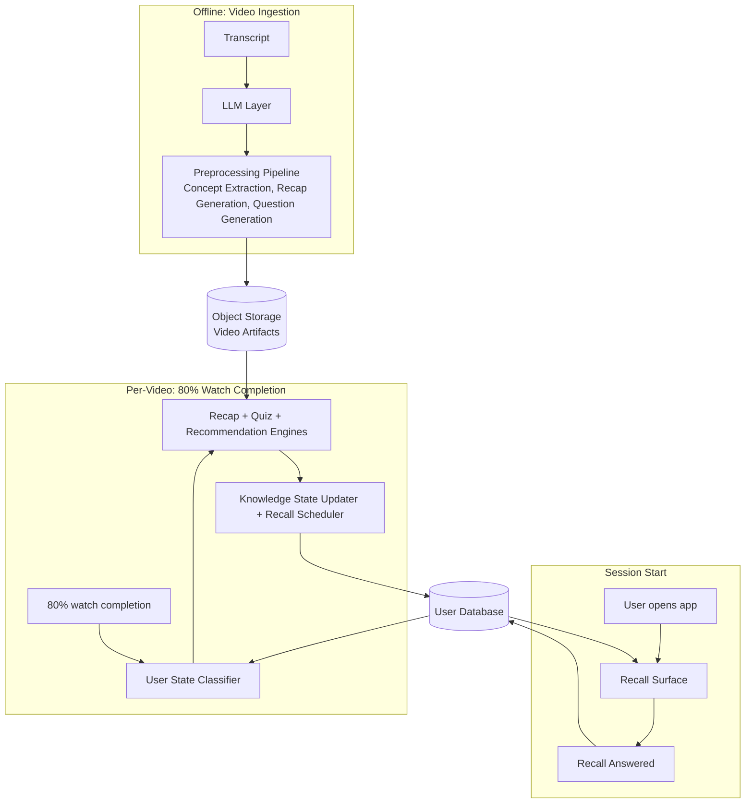

# Architecture

This document covers how Saathi is structured as a system: the components, the data stores, how they connect, and where the prototype differs from a production implementation. For the logic behind each component, see [05-solution-overview.md](05-solution-overview.md).

---

## System Diagram

Three phases. Two data stores. One LLM layer that only runs offline.



The LLM layer only appears in the offline phase. Everything in session start and per-video is selection, scoring, and read/write logic. No LLM calls happen at interaction time.

---

## Technology Choices

These apply to the whole system, not to any single component.

| Layer | Prototype | Production |
|---|---|---|
| **Language** | Python | Python |
| **API** | FastAPI (local) | FastAPI (hosted) |
| **UI** | Streamlit, calls FastAPI over HTTP | Seekho's mobile client, calls FastAPI over HTTP |
| **User database** | SQLite | Relational database |
| **Object storage** | MinIO (local, S3-compatible) | Any S3-compatible object storage |
| **LLM provider** | Anthropic (Claude) | Gemini |

The swap between prototype and production in every layer is a config change, not a code change. SQLite to a relational database requires only a connection string change if SQLAlchemy is used as the ORM. MinIO to any S3-compatible store requires only an endpoint URL and credentials change. The LLM layer swap is covered in detail below.

Streamlit calls FastAPI over HTTP in the prototype. This is intentional. The Streamlit UI and the FastAPI backend are separate processes. The demo shows real API calls, not in-process function calls pretending to be an API.

---

## LLM Layer

The LLM layer is a single `LLMClient` class. The preprocessing pipeline only ever calls `LLMClient`. It never references a provider directly.

Internally, `LLMClient` routes to a provider-specific wrapper based on a config value set at startup:

```
LLMClient
├── AnthropicWrapper   (prototype)
└── GeminiWrapper      (production)
```

Each wrapper implements the same interface: takes a prompt, returns a structured response. The pipeline code does not change when the provider changes. Only the config does.

For the prototype, `LLMClient` is instantiated with `provider=anthropic`. For Seekho's production stack, it is instantiated with `provider=gemini`.

---

## Components

Each component has a single responsibility. The table below covers what it reads, its prototype implementation, and what changes in production.

| Component | Reads | Writes | Prototype | Production |
|---|---|---|---|---|
| **Preprocessing Pipeline** | Transcript | Object storage | Manual Python script, triggered by hand | Event-driven, triggers on video ingestion via job queue |
| **User State Classifier** | User database | Nothing (output passed in memory) | FastAPI calls SQLite | FastAPI calls relational database |
| **Recap Engine** | Object storage, user database | Nothing (output passed in memory) | FastAPI reads MinIO and SQLite | FastAPI reads object storage and database |
| **Quiz Engine** | Object storage, user database | Nothing (output passed in memory) | FastAPI reads MinIO and SQLite | FastAPI reads object storage and database |
| **Response Evaluator** | Quiz answers, correct indices from object storage | Nothing (output passed in memory) | Fully deterministic, no data store needed | Identical, no changes needed |
| **Knowledge State Updater** | Quiz results, current user scores | User database | FastAPI writes to SQLite | FastAPI writes to relational database |
| **Progress Update** | Before and after scores from knowledge state update | Nothing (rendered to UI) | FastAPI returns string, Streamlit renders it | FastAPI returns string, mobile client renders it |
| **Recommendation Engine** | Object storage, user database | Nothing (output passed in memory) | FastAPI reads MinIO and SQLite | FastAPI reads object storage and database |
| **Recall Scheduler** | Quiz results, concept scores | User database (recall queue) | FastAPI writes to SQLite | FastAPI writes to relational database |

The component logic does not change between prototype and production. What changes is where they read from and write to.

---

## Data Layer

Three stores. Saathi owns two of them.

### Object Storage (Video Artifacts)

Written once by the preprocessing pipeline. Never updated after that. Contains the concept profile, recap bullets, and questions for every video.

Object storage is the right fit because these files are written once and read many times. The read pattern is high volume and predictable. The write pattern is rare and offline.

For the prototype, MinIO runs locally and exposes the same S3-compatible API that any production object store would. The preprocessing pipeline writes to MinIO. The pipeline components read from MinIO via FastAPI. In production, the MinIO endpoint is replaced with the actual object store endpoint. No code changes.

### Raw Videos

Seekho's existing storage. Saathi does not own or manage this. The preprocessing pipeline reads a transcript as its input, not the raw video file.

### User Database

Everything about a user lives here: knowledge state, watch history, and recall queue. One record per user.

A relational database is the right fit because user state is written frequently and needs to be reliable. When a quiz completes, knowledge state, watch history, and recall entries all update together. These writes need to be atomic: either all of them save or none of them do.

For the prototype, SQLite serves as the database. It runs as a local file, supports full SQL, and behaves identically to a production relational database for a single-user demo. SQLAlchemy is used as the ORM so the connection string is the only thing that changes when moving to production.

The recall queue is not a separate system. It is a table in the same database, with a user foreign key. At session start, one query fetches all pending entries for that user. Filtering and ranking happen in application code. The top 3-5 are returned.

```json
{
  "user_id": "priya_001",
  "knowledge": { ... },
  "watch_history": [ ... ],
  "recall_queue": [
    {
      "concept_key": "body_language",
      "source_video_id": "vid_003",
      "due_at": "2026-03-30T10:00:00Z",
      "interval_hours": 18,
      "missed_count": 0,
      "status": "pending",
      "last_question_id": null
    }
  ]
}
```

Priority is derived at read time, not stored. Eligible entries are filtered (time since last recall >= interval) and ranked by `urgency x importance`. No priority score is ever written to the queue. If a concept score changes between sessions, the ranking automatically reflects it.

---

## Write Events

There are exactly two moments that write to the user database.

**After every quiz completes (per-video pipeline):**

1. Knowledge state updated with new concept scores
2. Watch history entry written for the video
3. New recall entries written for each concept quizzed

All three happen together as a single atomic write.

**After a recall is answered (session start):**

1. Recall interval adjusted (doubled if correct, halved if wrong, minimum 12 hours)
2. Knowledge state updated with recall alpha (0.15)
3. Recall entry status updated and next `due_at` recalculated

These are separate from the per-video writes and only happen during the session start recall flow.

---

## Deployment

**Prototype**

Two local processes: Streamlit and FastAPI. Streamlit is the demo UI. FastAPI owns all pipeline logic and all data access. Streamlit calls FastAPI over HTTP. Data lives in SQLite (user state) and MinIO (video artifacts). The preprocessing pipeline is a separate Python script run manually before the demo, writing artifacts to MinIO and seeding SQLite with demo users.

**Production**

The same FastAPI backend runs hosted, behind a load balancer. Seekho's mobile client replaces Streamlit. The database swaps from SQLite to a production relational database. MinIO swaps to production object storage. The preprocessing pipeline runs as an async worker triggered on video ingestion via a job queue. No human trigger required.

---

## Scaling

The design scales cleanly because the most expensive operation (LLM inference) is completely absent from the interaction path.

**At interaction time, there are no LLM calls.** Every request from a user hits FastAPI, reads from the database and object storage, runs scoring and selection logic, and writes back. The cost per request is a few database reads and one write. This is fast, cheap, and scales horizontally by adding more FastAPI instances behind the load balancer. No LLM provider rate limits, no inference latency, no per-request LLM cost.

**The database handles concurrent writes** through connection pooling (a fixed pool of connections shared across API instances) and row-level locking (two users updating their own records never block each other). At prototype scale, SQLite handles this sequentially. At production scale, a relational database handles millions of concurrent writes without contention.

**Preprocessing scales via a job queue.** A video uploaded triggers a job. A pool of workers picks up jobs and processes them in parallel. Ten videos uploaded at once means ten jobs processed simultaneously. LLM rate limits apply here during preprocessing, but this is an offline, async process. It does not affect users.

**Where this stops being simple: conversational mode.**

The full Saathi vision includes a conversational mode where users interact with an AI in real time. That is a fundamentally different scaling problem. Every message is an LLM call. At Seekho's scale, that means millions of concurrent LLM requests, direct exposure to provider rate limits and latency, and per-request inference cost that compounds with usage. Caching, streaming, and careful prompt design can reduce the impact, but the problem does not go away. The proactive loop described in this prototype deliberately avoids this problem by moving all LLM work offline. Conversational mode will need a separate, dedicated architecture discussion before it is built.
