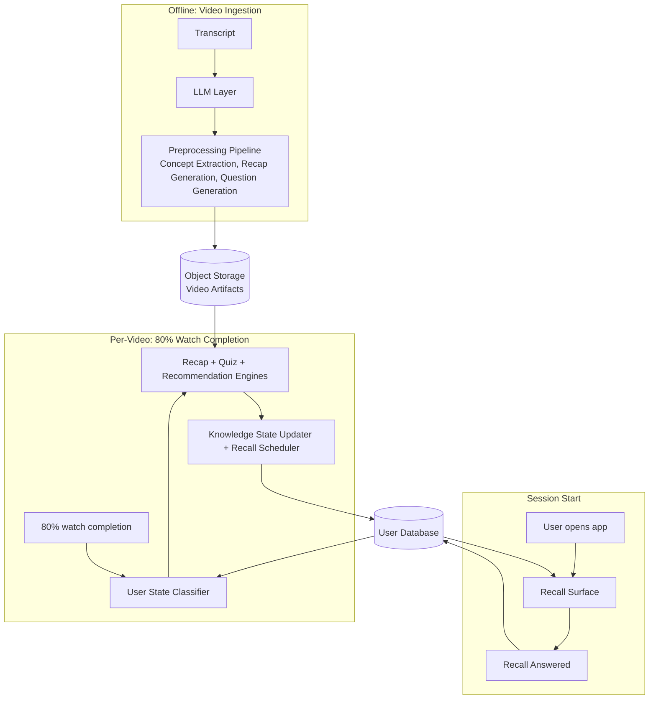

# Architecture

This document covers how Saathi is structured as a system: the components, the data stores, how they connect, and where the prototype differs from a production implementation. For the logic behind each component, see [05-solution-overview.md](05-solution-overview.md).

---

## System Diagram

Three phases. Two data stores. One LLM layer that only runs offline.



The LLM layer only appears in the offline phase. Everything in session start and per-video is selection, scoring, and read/write logic. No LLM calls happen at interaction time.

---

## Technology Choices

| Layer | Prototype | Production |
|---|---|---|
| **Language** | Python | Python |
| **API** | FastAPI (local) | FastAPI (hosted) |
| **UI** | Streamlit, calls FastAPI over HTTP | Seekho's mobile client, calls FastAPI over HTTP |
| **User database** | SQLite via SQLAlchemy | Relational database, same SQLAlchemy ORM |
| **Object storage** | MinIO (local, S3-compatible) | Any S3-compatible object storage |
| **LLM provider** | Anthropic (Claude) | Gemini |

Every swap between prototype and production is a config change. SQLAlchemy abstracts the database dialect so only the connection string changes. MinIO implements the S3 API so only the endpoint and credentials change. The LLM swap is handled by the LLM layer, covered below.

---

## LLM Layer

A single `LLMClient` class is the only interface the preprocessing pipeline uses. It never references a provider directly.

Internally, `LLMClient` routes to a provider-specific wrapper based on a config value set at startup:

```
LLMClient
├── AnthropicWrapper   (prototype)
└── GeminiWrapper      (production)
```

Each wrapper implements the same interface: takes a prompt, returns a structured response. Switching providers is a config change, not a code change.

---

## Components

| Component | Reads | Writes | Prototype | Production |
|---|---|---|---|---|
| **Preprocessing Pipeline** | Transcript | Object storage | Manual Python script | Event-driven via job queue on video ingestion |
| **User State Classifier** | User database | Nothing (passed in memory) | FastAPI reads SQLite | FastAPI reads relational database |
| **Recap Engine** | Object storage, user database | Nothing (passed in memory) | FastAPI reads MinIO and SQLite | FastAPI reads object storage and database |
| **Quiz Engine** | Object storage, user database | Nothing (passed in memory) | FastAPI reads MinIO and SQLite | FastAPI reads object storage and database |
| **Response Evaluator** | Quiz answers, correct indices | Nothing (passed in memory) | Fully deterministic | Identical |
| **Knowledge State Updater** | Quiz results, current scores | User database | FastAPI writes to SQLite | FastAPI writes to relational database |
| **Progress Update** | Before and after knowledge scores | Nothing (rendered to UI) | FastAPI returns string, Streamlit renders | FastAPI returns string, mobile client renders |
| **Recommendation Engine** | Object storage, user database | Nothing (passed in memory) | FastAPI reads MinIO and SQLite | FastAPI reads object storage and database |
| **Recall Scheduler** | Quiz results, concept scores | User database | FastAPI writes to SQLite | FastAPI writes to relational database |

Component logic does not change between prototype and production. What changes is where they read from and write to.

---

## Data Layer

Three stores. Saathi owns two of them.

### Object Storage (Video Artifacts)

Written once by the preprocessing pipeline at ingestion. Never updated after that. Contains the concept profile, recap bullets, and questions for every video.

MinIO runs locally for the prototype and exposes the same S3-compatible API as any production object store. In production, the endpoint URL points to the actual object store instead.

### Raw Videos

Seekho's existing storage. Saathi does not own or manage this. The preprocessing pipeline takes a transcript as input, not the raw video file.

### User Database

Knowledge state, watch history, and recall queue all live in one database per user.

SQLite serves as the database for the prototype. SQLAlchemy is the ORM. In production, only the connection string changes.

The recall queue is a table in the same database. At session start, one query fetches all pending entries for that user. Filtering by eligibility and ranking by priority happen in application code. Priority is derived at read time, not stored. This means if a concept score changes between sessions, the ranking automatically reflects it.

```json
{
  "user_id": "priya_001",
  "knowledge": { ... },
  "watch_history": [ ... ],
  "recall_queue": [
    {
      "concept_key": "body_language",
      "source_video_id": "vid_003",
      "due_at": "2026-03-30T10:00:00Z",
      "interval_hours": 18,
      "missed_count": 0,
      "status": "pending",
      "last_question_id": null
    }
  ]
}
```

---

## Write Events

There are exactly two moments that write to the user database.

**After every quiz completes (per-video pipeline):**

1. Knowledge state updated with new concept scores
2. Watch history entry written for the video
3. New recall entries written for each concept quizzed

All three happen as a single atomic write.

**After a recall is answered (session start):**

1. Recall interval adjusted (doubled if correct, halved if wrong, minimum 12 hours)
2. Knowledge state updated with recall alpha (0.15)
3. Recall entry status updated and next `due_at` recalculated

---

## Deployment

**Prototype**

Two local processes: Streamlit and FastAPI. Streamlit is the demo UI. FastAPI owns all pipeline logic and data access. Data lives in SQLite and MinIO. The preprocessing pipeline is a separate Python script run manually before the demo, writing artifacts to MinIO and seeding SQLite with demo users.

**Production**

FastAPI runs hosted behind a load balancer. Seekho's mobile client replaces Streamlit. SQLite is replaced by a relational database and MinIO by production object storage. The preprocessing pipeline runs as an async worker triggered on video ingestion via a job queue.

---

## Scaling

The interaction path has no LLM calls. Every user request hits FastAPI, reads from the database and object storage, runs scoring and selection logic, and writes back. This path scales horizontally by adding FastAPI instances behind the load balancer. It has no dependency on LLM provider availability, rate limits, or inference latency.

The database handles concurrent writes through connection pooling and row-level locking. Two users updating their own records never block each other.

Preprocessing scales via a job queue. A video upload triggers a job. Workers process jobs in parallel. LLM rate limits apply here but preprocessing is offline and async, so it does not affect users.

**Conversational mode is a different problem.**

The full Saathi vision includes real-time conversation between users and an AI. Every message in that flow is an LLM call. At Seekho's scale that means millions of concurrent requests, direct exposure to provider rate limits and inference latency, and per-request cost that compounds with usage. The proactive loop in this prototype avoids this entirely by moving all LLM work offline. Conversational mode needs a separate architecture discussion before it is built.
